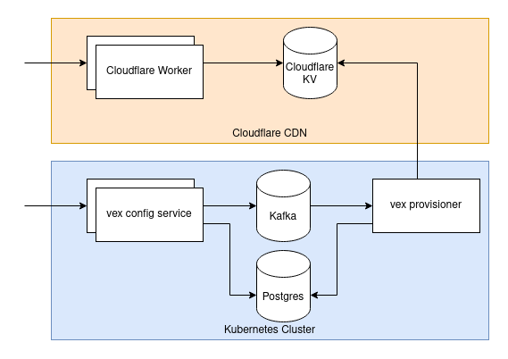

# Vex (Vexillology)

A service to manage feature flags and remote configuration.

Accounts can contain multiple projects which consist of a set of configuration flags.




## Accounts
`GET /accounts/{accountId}`

```json
{
  "name": "production account",
  "description": "the production account"
}
```

## Projects

A project is a set of configuration flags.

`GET /accounts/{accountId}/projects/{projectId}`
```json
{
  "name": "project1",
  "description": "the project for an application"
}
```

## Flags
Flags hold the configuration values for a project. They can be of types `BOOLEAN`, `NUMBER`, and `STRING`.

Flags store their raw value as strings with an enum that specifies their type. Each SDK can decide
how to parse the flag value in their own language.

`GET /accounts/{accountId}/projects/{projectId}/flags/{flagId}`
```json
{
  "key": "feature1",
  "type": "BOOLEAN",
  "value": "true"
}
```
```json
{
  "key": "feature2",
  "type": "NUMBER",
  "value": "123.45"
}
```
```json
{
  "key": "feature3",
  "type": "STRING",
  "value": "some text"
}
```

## CDN 

When projects are modified the configuration is rendered and provisioned in the Cloudflare CDN Worker.

This worker allows for fast and distributed access to the project configuration.

`GET /{accountId}/{projectId}`
```json
{
  "feature1": {
    "type": "BOOLEAN",
    "value": "true"
  },
  "feature2": {
    "type": "NUMBER",
    "value": "123.45"
  },
  "feature3": {
    "type": "STRING",
    "value": "some text"
  }
}
```
## Client Libraries

Go - https://github.com/broswen/vex-go

## Terraform

terraform-provider-vex - https://github.com/broswen/terraform-provider-vex

### Todo
- [x] handle postgres errors and wrap in custom store errors (ongoing)
- [x] provision account tokens to cloudflare kv
  - [x] implement worker token authentication
- [x] handle docker-compose initialize local postgres with schema
  - still need to handle multiple migrations
- [x] handle local provisioning for dockerfile, flag to skip api calls?
- [ ] add mocks and tests with testify
- [x] add created_on and modified_on fields to all resources
  -  figure out why postgres trigger/procedure isn't working
- [ ] incremental config builds
  - store prerendered config in postgres, parse and insert/update flags as needed
